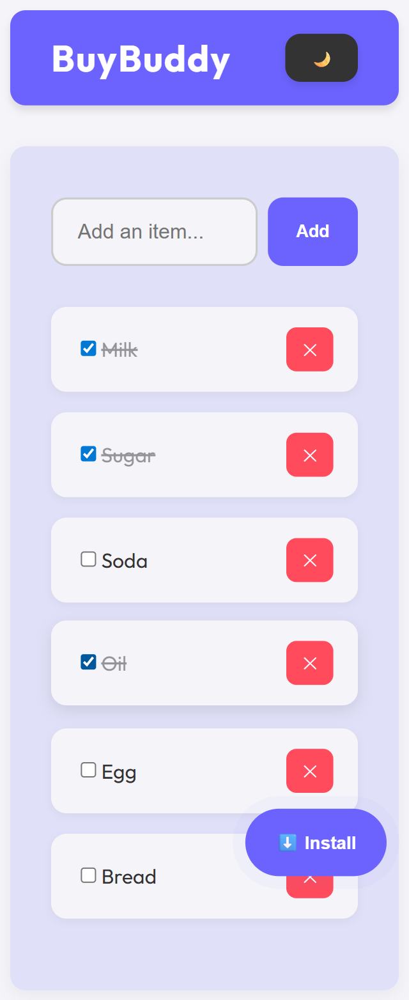
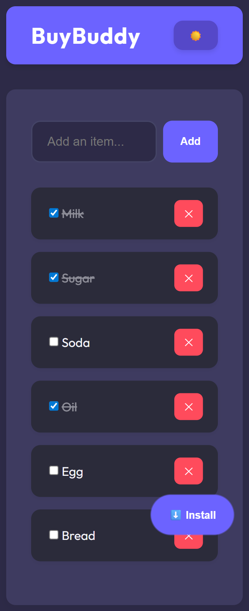

# 📋 BuyBuddy

BuyBuddy is a **Progressive Web App (PWA)** that helps you manage shopping or to-do lists with a clean and modern interface.  
It supports **light/dark themes**, offline use, and can be installed on mobile and desktop devices.

---

## 🚀 Live Demo  
🔗 **Live Site:** [BuyBuddy Demo](https://amolkamble4161.github.io/BuyBuddy/)  
📂 **Repository:** [BuyBuddy Repo](https://github.com/AmolKamble4161/BuyBuddy)

---

## ✨ Features
- ✅ Add, edit, and delete items  
- 🌗 Dark/Light mode toggle  
- 📱 Responsive & mobile-friendly design  
- 💾 Local storage support (data stays after refresh)  
- 📲 PWA installable on devices  
- 🖱️ Smooth UI with modern buttons & interactions  

---

## 🛠️ Tech Stack
- **HTML5**  
- **CSS3 (SCSS optional for styling)**  
- **JavaScript (Vanilla)**  
- **PWA (Service Worker + Manifest)**  
- **GitHub Pages (Deployment)**  

---
## PWA Install

- Open the site in Chrome/Edge
- Click the install prompt (or "Add to Home Screen" on mobile)

---
## 📷 Screenshots

| Light Mode                               | Dark Mode                              |
| ---------------------------------------- | -------------------------------------- |
|  |  |

---
## 🧩 Folder Structure

BuyBuddy/
│── index.html
│── style.css
│── script.js
│── manifest.json
│── sw.js
│── images/
│    └── all images/

---
## 📌 Future Improvements

- Drag & drop reordering
- Categories & filters
- Cloud sync with login
- Animations & transitions

---
